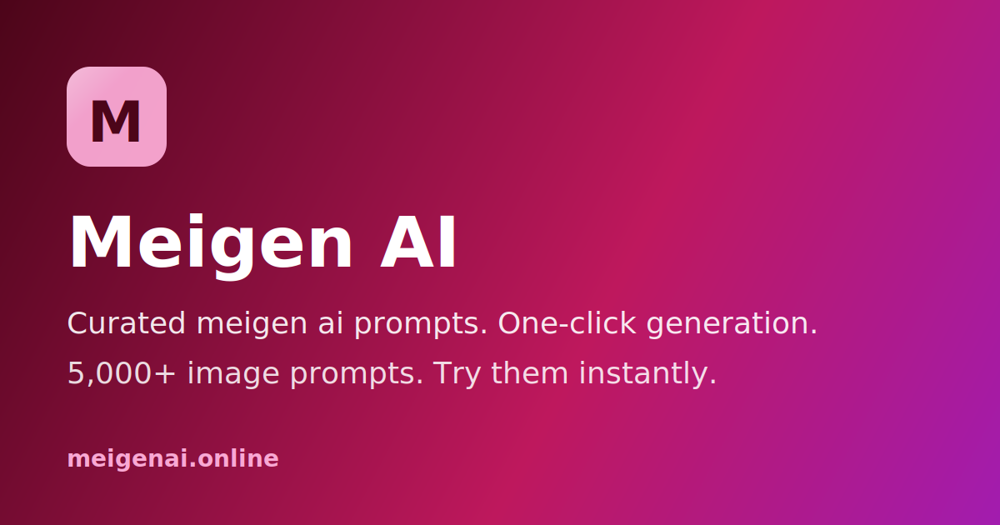

# Meigen AI MCP Server

> Meigen AI | Curated Meigen AI Prompts & Instant Generator

[](https://lobehub.com/mcp/rocnubie-meigenai-mcp)
[](./LICENSE)
[](https://nodejs.org)
[](#installation)
[](https://modelcontextprotocol.io)
[](https://smithery.ai)
[](#tools)

<p align="center"><a href="https://meigenai.online"></a></p>

A Model Context Protocol server that exposes the canonical Meigen AI knowledge surface — image generation workflows and styles, pricing, FAQ, official links — to MCP-compatible AI clients such as Claude Desktop, Cursor, Windsurf, and Continue. Read-only, no API keys, no quota, ~50 ms cold start.

Official website: https://meigenai.online

## 🎨 About Meigen AI

Meigen AI is a curated prompt gallery combined with an inline image generator, built for creators who want to go from inspiration to rendered output in a single step. The site hosts over 5,000 prompts collected from working creators, each paired with the actual image it produced. Visitors can browse by category, copy any prompt, translate it into one of 60+ languages, and run it through a built-in generation dock without switching tabs. The default engine is GPT Image 2, and users can swap to Flux, Nano Banana, Google Gemini, or Seedream depending on style preference or engine-specific syntax. New users receive 30 starter credits to test generation immediately, and browsing and copying prompts is free with no account required.

## Key Features

- **5,000+ curated prompts with rendered previews** — every entry shows the literal prompt text alongside the image it produced, so users see the output before committing to a run.
- **One-tap in-page generation** — a persistent generator dock lets users run, tweak, and re-run prompts without leaving the gallery page.
- **Multi-engine support** — GPT Image 2, Flux, Nano Banana, Google Gemini, and Seedream are all available; prompts are tagged with the engine they were authored for.
- **60+ language translation** — prompt translation preserves technical parameters such as aspect ratios, style tokens, and trigger words rather than doing a plain text translation.
- **20+ category filters** — Portrait, Cinematic, 3D, Product, Cyberpunk, and more, with a sticky category navigation bar for fast browsing.
- **Weekly trending updates** — new prompts are sourced from X, Reddit, Xiaohongshu, and Discord, keeping the library current with what creators are actually shipping.

## Use Cases

- A product photographer searches the "Product" category, finds a studio-lighting prompt that matches a client brief, translates it to adjust locale-specific style tokens, and generates a test render in under two minutes.
- A concept artist browsing the "Cyberpunk" filter copies five prompts, runs them through Flux for its color grading, and compares outputs side by side to pick a direction before opening their main tool.
- A brand director who does not write prompts natively uses the gallery as a starting library, copying and lightly editing prompts rather than building from scratch.
- A developer building a prompt-dependent feature uses the site to validate which phrasing patterns produce consistent outputs across engines before hardcoding anything.
- An illustrator tracks weekly trending prompts to stay aware of emerging aesthetics without spending time on social media research themselves.

## Who Is It For

Meigen AI is aimed at anyone whose work involves AI image generation but who spends too much time searching for prompts that actually work. The primary users are content creators, product photographers, concept artists, and brand-focused designers who need reliable output quickly. It is also useful for developers and founders who want to test image generation behavior across multiple engines without building their own prompt libraries from scratch. The site assumes no prior knowledge of prompt engineering — the gallery provides working examples, and the translation and generation tools handle the technical layer — making it accessible to both experienced practitioners and people just starting with AI image tools.

## Tools

### `list_styles`
Return the canonical list of image-generation styles or presets the site exposes. (Meigen AI)

_Input:_ no parameters. _Returns:_ text/markdown.

### `get_pricing`
Return the canonical pricing entry point for Meigen AI.

_Input:_ no parameters. _Returns:_ text/markdown.

### `get_official_links`
Return the canonical list of official links for Meigen AI (website, support, docs when available).

_Input:_ no parameters. _Returns:_ text/markdown.

## Resources

- `site://meigenai/styles` — Supported image-generation styles and presets.
- `site://meigenai/pricing` — Canonical pricing entry point.
- `site://meigenai/faq` — Short FAQ generated from public site metadata.
- `site://meigenai/links` — Canonical URLs to share with users.

## Prompts

### `tell_me_about_meigenai`
Summarize what the site is, who it's for, and how it works. — Meigen AI

### `try_image_style_meigenai`
Recommend a starting image-generation style for a stated goal. — Meigen AI

## Installation

### Install via Smithery

```bash
npx -y @smithery/cli install meigenai-mcp --client claude
```

(Replace `claude` with `cursor`, `windsurf`, or `continue` for those clients.)

### Install from source

```bash
git clone https://github.com/rocnubie/meigenai-mcp.git
cd meigenai-mcp
pnpm install
```

Then add to your MCP client config (`claude_desktop_config.json` for Claude Desktop, `mcp.json` for Cursor / Windsurf / Continue):

```json
{
  "mcpServers": {
    "meigenai-mcp": {
      "command": "node",
      "args": [
        "/absolute/path/to/meigenai-mcp/src/index.mjs"
      ]
    }
  }
}
```

### Debug with MCP Inspector

```bash
npx @modelcontextprotocol/inspector node src/index.mjs
```

## Official Links

- Website: https://meigenai.online
- Pricing: https://meigenai.online/pricing
- Community: https://x.com/meigenai
- Support: support@meigenai.online

## Development

```bash
pnpm install
pnpm start                 # run the server over stdio
```

## License

MIT
